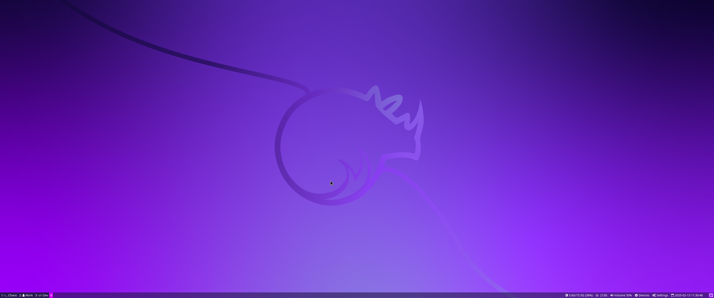
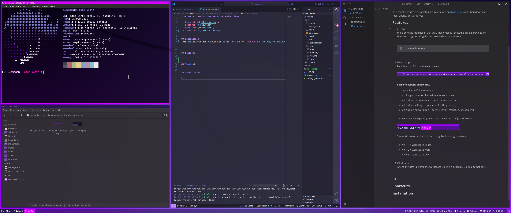

# Automated I3WM Unicorn setup for Rhino Linux

[- Description](#Description)\
[- Features](#Features)\
[- Shortcuts](#Shortcuts)\
[- Installation](#Installation)

## Description

This script provides a automated setup for i3wm on [rhino linux](https://rhinolinux.org/). (And should work on most ubuntu derivates too).

## Features

1. i3 Setup
   
   the i3 config is modified in that way, that it mostly reflect the design provided by rhinolinux.org. I'ts using the the provided colors and icons.
   
   
   
   
   
   
   

2. i3bar setup
   
   For i3bar the i3block extension is used.
   
   
   
   
   ###### Possible actions on i3blocks
   
   - right click on Volume = mute
   
   - scrolling on volume block = in/decrease volume
   
   - left click on devices = opens audio device selector
   
   - left click on settings = opens xfce4 settings dialog
   
   - left click on network icon = opens network manager conext menu
   
   
   Three named workspaces (Chaos, Work and Dev) configured already.
   
   
   
   The workspaces can be switched using the following shortcuts
   
   
   - win + 1 = workspace Chaos
   
   - win + 2 = workspace Work
   
   - win + 3 = workspace Dev

3. rofi menu
   
   Rofi menu (win + space) is configured using a rhino linus unicorn theme. You can search for files, commands and installed applications by selection the matching button un the bottom of the rofi dialog.
   
   
   
   

4. i3lock setup
   
   After 5 minutes idle time the workspace is getting locked by i3lock automatically.
   
   
   
   To unlock, simply start typing your password and hit enter.

## Shortcuts

###### Most important shortcuts (for a full list see config file)

win + shift +e = logoff

win + l = lock screen

strg = quit application

win + enter = terminal

win + d = dmenu

win + space = rofi menu

prnt = take full screenshot (stored in images folder)

shift + prnt = take selection screenshot (stored in images folder)

ctrl + print = take full screenshot (copied to clipboard)

ctrl + shift + print = take selection screenshot (save to clipboard)

win + 1 = Workspace 1

win + 2 = Workspace 2

win + 3 = Workspace 3

win + shift + 1 = move selected window to workspace 1

win + shift + 2 = move selected window to workspace 2

win + shift + 3 = move selected window to workspace 3

win + right = focus window right to selcted

win + left = focus left to selected

win + bottom = focus bottom winow toselected

win + up = focus top to selected

win + shift + right = move selected window right

win + shift + left = move selected windo left

win + shift + up = move selected window up

win + shift + down = move selected window down

## Installation

